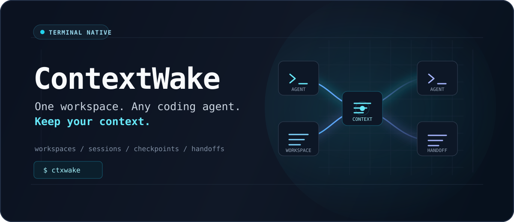
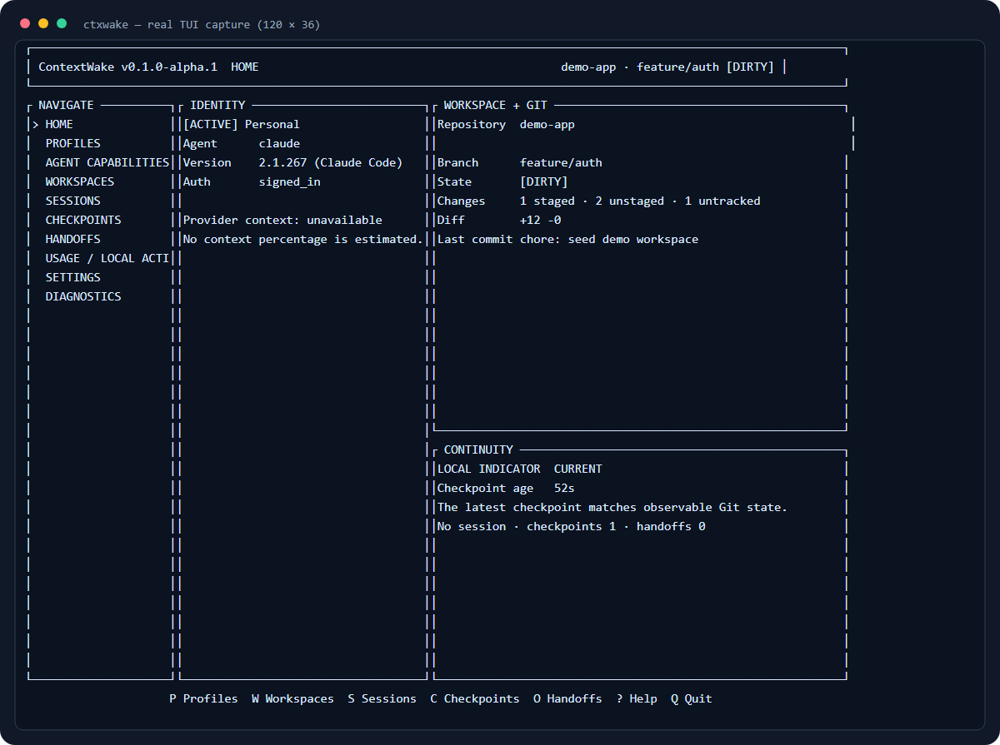

<p align="center">
  
</p>

<p align="center">
  <a href="https://github.com/mikeangelocasono/ContextWake/actions/workflows/ci.yml"></a>
  <a href="https://github.com/mikeangelocasono/ContextWake/releases"></a>
  <a href="LICENSE"></a>
  
</p>

<p align="center">
  <strong>One workspace. Any coding agent. Keep your context.</strong>
</p>

ContextWake is an open-source, terminal-native workspace and context-continuity manager for AI coding CLIs. It keeps profiles, workspaces, Git state, sessions, checkpoints, and portable handoffs explicit as you move among Codex CLI, Claude Code, GitHub Copilot CLI, Cursor CLI, OpenCode, Gemini CLI, Kiro CLI, Kimi Code, and Grok Build.

ContextWake is local-first. It has no web dashboard, hosted control plane, telemetry pipeline, or cloud account service. Coding-agent credentials remain owned by each agent.

The canonical command is `ctx`. The `ctxwake` executable remains available as a compatibility alias during the alpha migration; existing `.contextwake` project metadata, `CONTEXTWAKE_HOME`, and SQLite state are unchanged.

## Why ContextWake?

AI-assisted work is increasingly fragmented across agents, accounts, models, sessions, repositories, and branches. A provider may know its own conversation, but it does not necessarily know the state of another tool or identity.

ContextWake provides a local continuity layer around those agents:

- inspect the active profile, agent, model preference, workspace, and Git state;
- use a provider's native session resume only when the recorded identity is compatible;
- capture accessible project state in provider-neutral checkpoints;
- review and carry that state into a new agent session with a portable handoff;
- keep local activity distinct from unavailable provider quota or context metrics.

## ContextWake in action



_Real 120 x 36 ContextWake TUI capture from a disposable dirty Git fixture. The local repository path was replaced with `demo-app`; no provider output or feature was fabricated._

## Features

- Keyboard-first Ratatui dashboard with wide, narrow, tiny-terminal, empty, warning, and error states.
- Provider-neutral agent adapter, optional ACP transport, and graded capability system.
- Local profile metadata without plaintext passwords or copied access tokens.
- Git and non-Git workspace registry with branch, status, conflicts, ahead/behind, and diff summaries.
- Local session browser with search, archive, workspace/profile filters, and guarded native resume.
- Versioned checkpoints containing user-supplied objectives plus accessible workspace and Git evidence.
- Agent Workspace Handoff Format (AWHF) JSON and Markdown for portable context restoration.
- Transactional profile switching: target validation and artifact creation complete before activation.
- Context Guardian indicators based on local checkpoint age and observable Git drift.
- Privacy-safe diagnostics through `ctx doctor`.
- JSON CLI output, shell completions, SQLite schema migrations, and cross-platform automation.

## Supported AI coding agents

Support is deliberately capability-specific. "Partial" often means command construction and failure behavior are verified, while a disposable authenticated session test is still pending.

| Coding agent | Detection | Authentication | Sessions / native resume | Models | Portable handoff | Current status |
|---|---|---|---|---|---|---|
| OpenAI Codex CLI | Verified 0.154.0 on Windows | Verified | Authenticated resume pending | Selection | Verified | Partial |
| Claude Code | Verified 2.1.270 on Windows | Verified | Authenticated resume pending | Hosted modes | Verified | Partial |
| GitHub Copilot CLI | Contract tested; not locally installed | Unknown without spending a request | Session metadata contract; resume pending auth | Selection | Contract tested | Partial |
| Cursor CLI | Verified 2026.07.23 on Windows | Verified | Interactive listing unsupported; resume pending auth | Dynamic catalog verified | Contract tested | Partial |
| OpenCode | Verified 1.18.25 on Windows | Partial | JSON listing; resume pending auth | Dynamic/local catalog verified | Verified | Partial |
| Gemini CLI | Verified 0.59.0 on Windows | Unknown non-interactively | Resume pending auth | Selection | Contract tested | Partial |
| Kiro CLI | Verified 2.21.3 in prior Windows QA | Verified in prior QA | Same-identity resume verified | Dynamic catalog verified | Contract tested | Partial; isolated Windows identities unsupported |
| Kimi Code CLI | Contract tested; not locally installed | Unknown | Session metadata contract; resume pending auth | Selection | Partial | Partial |
| Grok Build | Verified 0.2.114 on Windows | Signed-out boundary verified | Session metadata contract; resume pending auth | Dynamic catalog verified | Contract tested | Partial |

See the [full compatibility matrix](docs/providers/compatibility.md) and provider guides for [Codex](docs/providers/codex.md), [Claude Code](docs/providers/claude.md), [GitHub Copilot](docs/providers/github-copilot.md), [Cursor](docs/providers/cursor.md), [OpenCode](docs/providers/opencode.md), [Gemini CLI](docs/providers/gemini.md), [Kiro](docs/providers/kiro.md), [Kimi Code](docs/providers/kimi.md), and [Grok Build](docs/providers/grok.md).

A coding agent is not a model provider. For example, Cursor or GitHub Copilot can offer models from several vendors, while OpenCode can target local runtimes. ContextWake registers the agent once and stores provider/model selection separately.

## How context continuity works

ContextWake never treats cross-agent context restoration as conversation transfer.

### Native Resume

```text
same coding agent + same authorized profile + native provider session
                              |
                              v
                         Native Resume
```

The provider resumes its own session. ContextWake only offers this path when the local record, active profile, and adapter capability agree.

### Portable Handoff

```text
Codex / Personal
       |
       | switch to Claude / Work
       v
   Checkpoint  -->  AWHF handoff  -->  new Claude Code session
                                                |
                                                v
                                  Restored from Handoff
```

A handoff can contain objective, current task, completed work, decisions, constraints, changed files, Git summary, validation results, known issues, pending work, and trusted project instructions. It excludes credentials, hidden reasoning, chain-of-thought, and inaccessible provider state.

## Installation

### Windows x86_64

Download `contextwake-v0.1.0-alpha.1-windows-x86_64.zip` and `SHA256SUMS` from the [v0.1.0-alpha.1 prerelease](https://github.com/mikeangelocasono/ContextWake/releases/tag/v0.1.0-alpha.1), verify the archive, extract it, and run:

```powershell
Get-FileHash .\contextwake-v0.1.0-alpha.1-windows-x86_64.zip -Algorithm SHA256
Expand-Archive .\contextwake-v0.1.0-alpha.1-windows-x86_64.zip -DestinationPath .
.\contextwake-v0.1.0-alpha.1-windows-x86_64\ctxwake.exe doctor
```

The alpha executable is unsigned. Do not disable Defender or other platform protection; compare its hash with `SHA256SUMS`.

The immutable `v0.1.0-alpha.1` archive predates the short command and contains `ctxwake.exe`; the next alpha archives contain both `ctx.exe` and the compatibility `ctxwake.exe`.

### Linux x86_64

Download `contextwake-v0.1.0-alpha.1-linux-x86_64.tar.gz` and `SHA256SUMS` from the prerelease, then:

```sh
sha256sum --ignore-missing -c SHA256SUMS
tar -xzf contextwake-v0.1.0-alpha.1-linux-x86_64.tar.gz
./contextwake-v0.1.0-alpha.1-linux-x86_64/ctxwake doctor
```

### macOS

Download `contextwake-v0.1.0-alpha.1-macos-aarch64.tar.gz` and `SHA256SUMS` from the prerelease, then:

```sh
shasum -a 256 contextwake-v0.1.0-alpha.1-macos-aarch64.tar.gz
tar -xzf contextwake-v0.1.0-alpha.1-macos-aarch64.tar.gz
./contextwake-v0.1.0-alpha.1-macos-aarch64/ctxwake doctor
```

The Apple Silicon artifact is GitHub Actions-built but unsigned and not notarized. Keep Gatekeeper enabled, verify the checksum, and use macOS's normal explicit approval flow if you choose to run this alpha. Automated CI is not physical-device TUI validation.

### Build from source

Install Rust 1.88 or newer and Git, then:

```sh
git clone https://github.com/mikeangelocasono/ContextWake.git
cd ContextWake
cargo build --release --locked
./target/release/ctx --version
```

On Windows, run `.\target\release\ctx.exe --version` instead. ContextWake also ships a temporary `ctxwake` compatibility executable in release archives. Coding-agent CLIs are optional unless you want to use their adapters.

## Quick Start

```sh
# Inspect the machine and current directory
ctx doctor
ctx status
ctx agent detect

# Register a legitimate local profile and this workspace
ctx profile add Personal --agent codex --model-provider openai
ctx workspace add .

# Capture accessible project state
ctx checkpoint create --objective "Continue the current implementation"
ctx checkpoint list

# Launch the TUI
ctx
```

Authenticate through the coding agent when needed:

```sh
ctx profile login personal
```

ContextWake initiates the provider-owned login flow; it does not ask you to paste a token into its configuration.

## Usage

The CLI and TUI use the same application services and SQLite state.

| Area | Useful commands |
|---|---|
| Status | `ctx status`, `ctx doctor --verbose` |
| Agents | `ctx agent list`, `ctx agent detect`, `ctx agent info codex` |
| Profiles | `ctx profile add`, `list`, `show`, `use`, `login`, `logout`, `remove` |
| Workspaces | `ctx workspace add`, `list`, `show`, `open`, `validate`, `remove` |
| Sessions | `ctx session sync`, `list`, `show`, `resume`, `archive` |
| Checkpoints | `ctx checkpoint create`, `list`, `show`, `export`, `delete` |
| Handoffs | `ctx handoff create`, `list`, `show`, `preview`, `export`, `import`, `continue` |
| Models | `ctx model list`, `ctx model select` |
| Configuration | `ctx config show`, `path`, `validate`, `set` |
| Automation | `ctx --json ...`, `ctx completion <shell>` |

Run `ctx <command> --help` for exact arguments. The legacy `ctxwake` executable remains available as a compatibility alias during the alpha migration. Use `--ascii` when the terminal cannot render Unicode status markers.

## Example workflow

```sh
# While Codex / Personal is active in the current project
ctx checkpoint create \
  --objective "Ship the authentication flow" \
  --task "Add refresh-token failure coverage" \
  --completed "Implemented token rotation" \
  --decision "Authentication errors return typed results" \
  --pending "Add integration tests"

# Switch explicitly; ContextWake creates continuity before activation
ctx profile use work --handoff \
  --objective "Continue the authentication flow" \
  --workspace .

# Review the generated package before starting a new provider session
ctx handoff list
ctx handoff preview <handoff-id>
ctx handoff continue <handoff-id>
```

The last command starts a **new** agent session restored from the handoff. It is not reported as Native Resume.

The repository also contains a [deterministic continuity demo](demo/README.md) and a [seven-hop cross-agent QA matrix](docs/qa/cross-agent-continuity.md). Both distinguish artifact contract evidence from live destination-model comprehension.

## TUI controls

| Key | Action |
|---|---|
| `G` | Home dashboard |
| `P` / `I` | Profiles / agent capabilities |
| `W` / `S` | Workspaces / sessions |
| `C` / `O` | Checkpoints / handoffs |
| `U` / `D` / `T` | Local activity / diagnostics / settings |
| `J`, `K`, arrows | Move selection |
| `Enter` | Open or confirm the current action |
| `/` | Search sessions |
| `F` | Cycle agent filters on the capabilities screen |
| `R` | Refresh local and provider state |
| `Esc` | Back or cancel |
| `?` | Key reference |
| `Q` | Quit |

Identity changes show Git evidence and require confirmation. Handoff previews require a separate action before an agent is launched.

## Local data

`CONTEXTWAKE_HOME` overrides all platform paths and creates `config/`, `data/`, and `cache/` beneath the selected directory. Without an override, ContextWake uses native application directories:

| Platform | Configuration | Local state |
|---|---|---|
| Windows | `%APPDATA%\ContextWake\ContextWake\config` | `%LOCALAPPDATA%\ContextWake\ContextWake\data` |
| Linux | `$XDG_CONFIG_HOME/contextwake` | `$XDG_DATA_HOME/contextwake` |
| macOS | `~/Library/Application Support/dev.ContextWake.ContextWake` | Same application-support root |

Use `ctx config path` or `ctx doctor --verbose` to see the exact paths selected on a machine. Repository-local, non-secret metadata lives in `.contextwake/project.toml`; see [configuration](docs/configuration.md).

## Security and privacy

- Local-first storage and telemetry disabled by default.
- Provider-owned authentication; no ContextWake credential table or token export.
- Fixed executable/argument arrays rather than user-built shell commands.
- Bounded provider probes and sanitized terminal output.
- Strict, size-bounded handoff schemas with hashes, secret scanning, traversal checks, and symlink rejection.
- Repository validation commands remain untrusted until explicitly approved and never run on open.
- No automatic Git commit, stash, reset, push, or history mutation.
- Local activity is never labeled as provider credits, quota, balance, or token availability.

ContextWake is not designed to bypass provider quotas, rate limits, subscription restrictions, authentication controls, or provider Terms of Service.

ContextWake is an independent open-source project and is not affiliated with the coding-agent vendors. Product names and trademarks belong to their respective owners.

Read the [security model](docs/security.md), [data classification](docs/data-classification.md), and [vulnerability reporting policy](SECURITY.md).

## Platform support

| Platform | Current evidence |
|---|---|
| Windows 11 x86_64 | Native format/check/strict Clippy and 110 tests; nine-agent bounded detection with live Cursor and Grok Build probes |
| Linux x86_64 | WSL Rust 1.88 format/check/strict Clippy, 114 tests, optimized build, RustSec audit, and clean-tree package verification passed |
| macOS Apple Silicon | GitHub-hosted format/strict Clippy, 114 tests, release build, binary smoke tests, and PATH-collision check passed; no physical-device TUI QA |

## Current limitations

- Authenticated native resume remains pending for every adapter except the prior verified Kiro same-identity path.
- Kiro same-identity resume is verified, but its Windows OS credential is shared across `KIRO_HOME` roots; ContextWake does not advertise isolated Kiro profiles.
- Cursor settings can be scoped, but local QA proved its authenticated identity remains global; Copilot, Kimi, and Grok multi-identity isolation awaits authenticated QA.
- Cross-agent artifact fidelity is verified; authenticated destination-agent comprehension still needs deliberately authorized disposable profiles.
- Current adapters do not expose reliable provider quota balances or context percentages.
- The TUI refresh path is synchronous; event-driven background refresh is planned.
- Windows artifacts are unsigned; macOS signing, notarization, and physical-device QA remain pending.

See [IMPLEMENTATION_STATUS.md](IMPLEMENTATION_STATUS.md) for evidence and remaining work.

## Roadmap

- Complete authenticated provider resume and cross-agent comprehension QA.
- Add event-driven TUI refresh and richer model selection.
- Extend session ingestion where providers expose stable structured metadata.
- Add property/fuzz testing for handoff and provider parsers.
- Design a signed, versioned adapter SDK before considering third-party plugins.

## Architecture

```text
                          ContextWake
                              |
             +----------------+----------------+
             |                |                |
        Workspaces         Sessions         Profiles
             |                |                |
             +----------------+----------------+
                              |
                      Continuity Engine
                              |
                       AgentAdapter API
                              |
                  AgentAdapter registry
             +------------+------------+
             |            |            |
          Existing     New vendors   Local/open
             |            |            |
       Codex/Claude   Copilot/Cursor   OpenCode
       Gemini/Kiro    Kimi/Grok        model backends
```

Agents, model providers, models, profiles, workspaces, sessions, checkpoints, and handoffs remain separate domain objects. Read the [architecture](docs/architecture.md), [provider guide](docs/providers/adding-a-provider.md), and the [language/TUI](docs/adr/0001-language-and-tui-stack.md), [storage](docs/adr/0002-storage.md), [adapter](docs/adr/0003-provider-adapter-model.md), [CLI command](docs/adr/0005-cli-command-name.md), and [ACP transport](docs/adr/0006-acp-provider-transport.md) decisions.

## Development and testing

Standard tests use disposable workspaces and mock/isolated provider boundaries. No paid account or provider credential is required.

```sh
cargo fmt --all -- --check
cargo clippy --locked --workspace --all-targets --all-features -- -D warnings
cargo test --locked --workspace --all-targets --all-features
cargo build --locked --workspace --release
cargo audit
cargo package --locked
```

See [development setup](docs/development.md) and [CONTRIBUTING.md](CONTRIBUTING.md). Contributions must preserve truthful capability reporting, explicit account switching, and the terminal-only product boundary.

## Security reporting

Please use GitHub's private security-advisory flow. Do not post credentials, private paths, raw authentication files, or unredacted diagnostics in a public issue. Details are in [SECURITY.md](SECURITY.md).

## Community

Please read the [Code of Conduct](CODE_OF_CONDUCT.md) before participating. Bug reports, feature proposals, and provider compatibility reports are welcome through the repository issue templates.

## License

Licensed under [Apache-2.0](LICENSE).
